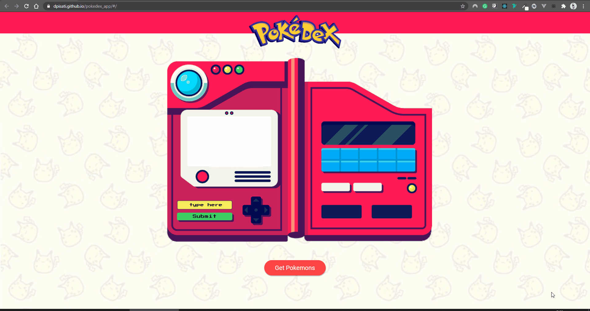

<h3 align="center">
    
    <br><br>
    <b>Search for your favorite Pokemon with Pokedex App!</b>  
    <br>
</h3>

# Index

- [About](#about)
- [Technologies](#technologies)
- [How to use](#how-to-use)

<a id="about"></a>

## :bookmark: About

<strong>Pokedex App</strong> is a online library to help people find your favorite Pokemon.

This application was made to exercise the connection between <strong>Reaxt</strong> and an outside API promoted by [PokéAPI](https://pokeapi.co/).

<a id="technologies"></a>

## :rocket: Technologies

The project is made with:

- [Node.js](https://nodejs.org/en/)
- [ReactJS](https://reactjs.org/)

## :heavy_check_mark: :computer: Web

<h1 align="center">
    
</h1>


<a id="how-to-use"></a>

## :fire: How to Use

- ### **Dependencies**

  - Is **required** to install **[Node.js](https://nodejs.org/en/)**
  - In order to run scripts and install dependencies you need to install a **package manager** (ie: **[NPM](https://www.npmjs.com/)**).
  
  <br><br>

1. First step, clone this github repository:

```sh
  $ git clone https://github.com/dpisati/pokedex_app.git
```

2. Run the application:

```sh
  # Install dependencies for each folder: mobile, server, web.
  $ cd pokedex_app
  $ npm install

  # Start the web application
  $ npm start

```
